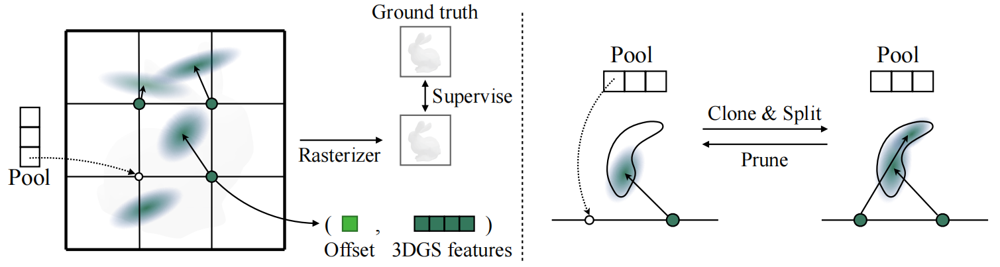

# GaussianVolume Fitting 🧊

Implementation of Candidate Pool Strategy (CPS) from <a href="https://arxiv.org/abs/2403.12957">GVGEN: Text-to-3D Generation with Volumetric Representation</a> in Pytorch.


<p align="center">

<p>


The purpose of CPS is to construct volumetric 3DGS representations for better distribution to aid in diffusion model training.

## 🐉 Procedure 

- Step 1 : Environment Preparation 

Follow intructions from [gaussian splatting](https://github.com/graphdeco-inria/gaussian-splatting) to prepare packages required for 3DGS fitting and [objaverse-rendering](https://github.com/cvlab-columbia/zero123/tree/main/objaverse-rendering) for multi-view images dataset preparing.

- Step 2 : Multi-view Images Rendering 

Get a multi-view image of an object by using the command in [objaverse-rendering](https://github.com/cvlab-columbia/zero123/tree/main/objaverse-rendering). 
Put the obtained multi-view images into the `datas` folder and get the following data structure:

```
datas
├── obj_id_1
│   ├── 000.png
│   ├── 000.npy
│   ├── 001.png
│   ├── 001.npy
│   └── ...
│
├── obj_id_2
│   └── ...
│
└── obj_id_n
    └── ...
```

To get better multi-view rendering, we provide our `blender_script.py`, which you can replace the corresponding script in [objaverse-rendering](https://github.com/cvlab-columbia/zero123/tree/main/objaverse-rendering).


- Step 3 : GaussianVolume Fitting

e.g.

```
obj_id=f1722ab650ad4d8dbe6fc4bf44e33d38
python train.py \
    -w 1 \
    --sh_degree 0 \
    -s datas/${obj_id} \
    -m output/${obj_id} \
    --prepare_data # 
```

- Step 4 : Checking

If you want to render the image, leave the `prepare_data` option out of Step 3.

```
python render.py \
    -m output/${obj_id} 
```